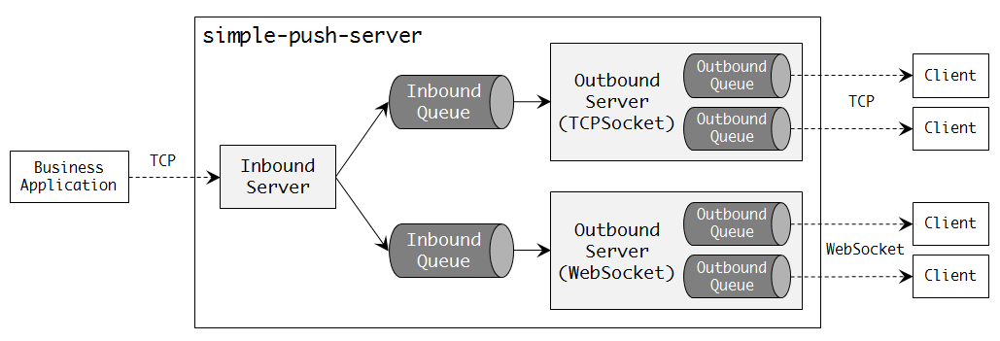

# simple-push-server

#### 개요
비즈니스 어플리케이션에서 발생하는 이벤트에 대해 클라이언트에게 메시지를 Push 해준다. Push 기능 자체는 어플리케이션에서 다양한 방식으로 구현 가능하지만, 관제 시스템과 같이 모니터링 용도로 사용하는 시스템에서는 업무 또는 이벤트에 따라 클라이언트에게 다량의 메시지를 전송해야 하는데 이와 같은 경우에 활용할 수 있다. 현재는 단방향 Push 기능만을 제공한다.

#### 주요 특징
* Netty 프레임워크 기반으로 비동기 통신 사용
* 독립적인 프로세스로 구동되어 비지니스 어플리케이션과 연동
* 비즈니스 어플리케이션이 Java 기반인 경우 임베디드된 형태로 통합 가능
* 클라이언트와의 통신은 TCP Socket, WebSocket 활용
* 송수신 메시지는 JSON 문자열 사용
* 서비스ID 및 클라이언트ID를 사용하여 전체 클라이언트 전송 또는 특정 클라이언트만 전송 가능
* 서비스ID 단위로 설정(통신방식, 포트, 큐 사이즈 등)을 통해 확장 가능
* 서비스별 큐, 클라이언트별 큐를 사용하여 상호간의 간섭을 줄이고 메시지 유실 최소화

#### 기본 구조


#### 컴포넌트 설명
##### 1. Business Application
* Push 메시지 생성 주체
* Inbound Server에 TCP Socket으로 연결하여 Push 메시지 송신
* 통합 구성인 경우 서비스ID로 적절한 Inbound Queue 인스턴스를 찾아 메시지 추가
* 메시지는 [PushMessage.java](https://github.com/gallechess/simple-push-server/blob/master/src/chess/push/util/PushMessage.java) 타입에 바인딩 가능한 JSON 문자열
  (메시지 구분자: "\r\0")

##### 2. Inbound Server
* 비즈니스 어플리케이션과 연동하여 Push할 메시지를 수신받는 서버
* 전역적으로 1개 인스턴스만 존재
* TCP 소켓통신 사용
* 수신 메시지에 담긴 서비스ID에 따라 적절한 InboundQueue에 메시지 추가

##### 3. Inbound Queue
* 서비스ID에 따라 하나씩 생성되는 메시지 큐
* Inbound Server가 Push 메시지를 전달하는 대상
* 별도 쓰레드로 동작하여 큐에 쌓인 메시지를 서비스ID와 클라이언트ID에 따라 적절한 Outbound Queue로 이동

##### 4. Outbound Server
* 클라이언트의 연결을 처리하는 서버
* 설정을 통해 TCP Socket과 WebSocket 중 선택 가능
  (WebSocket 방식인 경우 Web Socket URI 지정 필요)
* 클라이언트 연결/해제시 Outbound Queue 인스턴스 생성/제거
* 클라이언트가 클라이언트ID 송신시 이를 채널 속성으로 설정
  (클라이언트ID는 클라이언트 지정 Push를 위한 구분용)

##### 5. Outbound Queue
* 클라이언트가 Outbound Server에 연결시 생성되는 큐
* Inbound Queue가 Push 메시지를 전달하는 대상
* 별도 쓰레드로 동작하여 큐에 쌓인 메시지를 클라이언트 채널에 전송
* TCP Socket 연결인 경우 메시지 구분자 "\r\0" 사용

##### 6. Client
* Push 메시지를 수신받는 대상
* 사전에 Outbound Server의 주소 정보 인지 필요
* Outbound Server에 연결 후 클라이언트ID를 전송 가능
  (클라이언트ID 전송 메시지: {"clientId":"본인ID"})

#### 사용 방법
서버의 실행은 [Server.java](./src/chess/push/server/Server.java) 인스턴스를 생성하여 startupServer() 메소드를 호출한다.
테스트 서버 실행은 [TestServerMain.java](./test/chess/push/server/TestServerMain.java)를 참고한다.

서버 및 서비스 설정은 Spring Framework를 사용할 경우 [application.xml](./testResource/application.xml)을 참고한다.
```
<!-- 기본 속성 설정 -->
<bean id="baseProperty" class="chess.push.server.property.PushBaseProperty">
    <!-- Inbound Server listen port -->
    <property name="inboundServerPort" value="8000" />
    <!-- Inbound Queue 상태 모니터링 쓰레드 동작 주기 (초) -->
    <property name="inboundQueueCheckInterval" value="5" />
    <!-- Outbound Queue 상태 모니터링 쓰레드 동작 주기 (초) -->
    <property name="outboundQueueCheckInterval" value="5" />
</bean>

<!-- 서비스 속성 설정 -->
<!-- TCP Socket 통신방식 -->
<bean class="chess.push.server.property.PushServiceProperty">
    <!-- 전체 서비스에서 고유한 Service ID -->
    <property name="serviceId" value="test1.tcpsocket" />
    <!-- Inbound Queue 용량 -->
    <property name="inboundQueueCapacity" value="100000" />
    <!-- Outbound Queue 용량 -->
    <property name="outboundQueueCapacity" value="10000" />
    <!-- Outbound Server listen port -->
    <property name="outboundServerPort" value="8001" />
    <!-- Outbound Server 통신방식 (TCPSOCKET, WEBSOCKET) -->
    <property name="outboundServerType" value="TCPSOCKET" />
</bean>
<!-- WebSocket 통신방식 -->
<bean class="chess.push.server.property.PushServiceProperty">
    <!-- 전체 서비스에서 고유한 Service ID -->
    <property name="serviceId" value="test2.websocket" />
    <!-- Inbound Queue 용량 -->
    <property name="inboundQueueCapacity" value="100000" />
    <!-- Outbound Queue 용량 -->
    <property name="outboundQueueCapacity" value="10000" />
    <!-- Outbound Server listen port -->
    <property name="outboundServerPort" value="8002" />
    <!-- Outbound Server 통신방식 (TCPSOCKET, WEBSOCKET) -->
    <property name="outboundServerType" value="WEBSOCKET" />
    <!-- WebSocket URI -->
    <property name="outboundServerWsUri" value="/test2" />
</bean>
```

Spring Framework를 사용하지 않는 경우 직접 [PushBaseProperty.java](./src/chess/push/server/property/PushBaseProperty.java) 인스턴스와 [PushServiceProperty.java](./src/chess/push/server/property/PushServiceProperty.java) 인스턴스를 생성하여 [Server.java](./src/chess/push/server/Server.java) 인스턴스의 startupServer() 메소드 호출시 파라미터로 전달하면 된다.

클라이언트는 TCP Socket 방식의 경우 [TestTcpSocketClient.java](./test/chess/push/client/TestTcpSocketClient.java)를 참고하고 WebSocket 방식의 경우 [TestWebSocketClient.html](./test/chess/push/client/TestWebSocketClient.html)을 참고한다.

서버를 독립적으로 구동하지 않고 비즈니스 어플리케이션에 임베디드시킬 경우에는 [TestEmbedServerMain.java](./test/chess/push/server/TestEmbedServerMain.java)를 참고한다.

비즈니스 어플리케이션과 클라이언트는 Push 서버와 연결이 끊어질 경우 재접속 메커니즘을 구현해야 한다.
